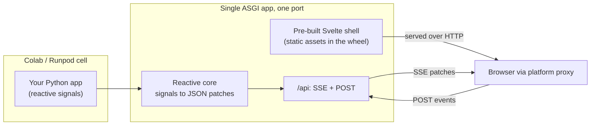

# indah

**A Python UI framework for ephemeral cloud notebooks (Colab, Runpod). Reactive,
single-port, no Node required.**

Build an interactive UI from a single Python file and launch it straight from a
Colab or Runpod cell. It keeps Streamlit's zero-config, single-port startup, adds
the async performance of a real full-stack app, and ships its frontend pre-built
so there is no Node, npm, or bun anywhere at install or runtime.

> **Status: early planning.** `indah` is not usable yet. This repository currently
> holds the plan and a `0.0.x` placeholder that reserves the name on PyPI. If you
> want to follow along, start with [`docs/PLAN.md`](docs/PLAN.md).

## Why another one

| Pain | indah's answer |
|------|----------------|
| Streamlit reruns the whole script on every interaction | Reactive signals: only the affected components update ([ADR-0003](docs/adr/0003-reactive-signals-model.md)) |
| Gradio's layout and state model get awkward past a demo | Plain Python components bound to state, custom layouts |
| Reflex needs a Node build step that breaks in transient containers | Frontend ships pre-built in the wheel; zero runtime Node ([ADR-0004](docs/adr/0004-svelte-prebuilt-shell.md)) |
| Colab's proxy does not support WebSockets | SSE + HTTP POST transport that passes the proxy ([ADR-0002](docs/adr/0002-sse-plus-post-transport.md)) |

## How it will work



One port, standard HTTP plus Server-Sent Events, so it works through the network
proxies of Colab and Runpod without a tunnel or a local JavaScript toolchain.

## Try the placeholder

```bash
pip install indah        # reserves the name; no framework yet
python -c "import indah; print(indah.__version__)"
```

There is no public API yet. The first working slice ("a live pixel through the
proxy") is described in [`docs/SLICES.md`](docs/SLICES.md).

## Planning and design

| Doc | What |
|-----|------|
| [`docs/PLAN.md`](docs/PLAN.md) | Problem, solution, scope, requirements, architecture |
| [`docs/SLICES.md`](docs/SLICES.md) | Vertical build increments with test plans |
| [`docs/QUESTIONS.md`](docs/QUESTIONS.md) | Decision register |
| [`docs/adr/`](docs/adr/) | Architecture Decision Records |

## Development

```bash
uv sync --extra dev
make check        # lint + fast tests (the pre-push gate)
make help         # list all targets
```

See [`AGENTS.md`](AGENTS.md) for repo conventions and [`docs/RELEASING.md`](docs/RELEASING.md)
for the release process.

## License

[Apache License 2.0](LICENSE).
