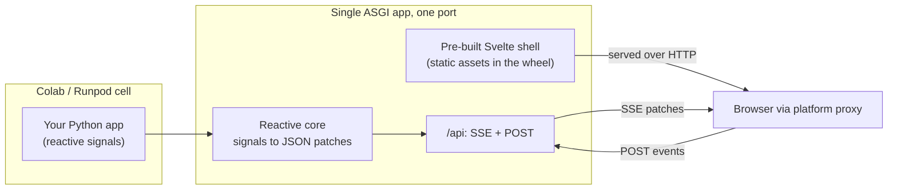

# indah

[](https://pypi.org/project/indah/)
[](https://pypi.org/project/indah/)
[](LICENSE)
[](https://github.com/leejianrong/indah/actions/workflows/ci.yml)

**A Python UI framework for ephemeral cloud notebooks (Colab, Runpod). Reactive,
single-port, no Node required.**

Build an interactive UI from a single Python file and launch it straight from a
Colab or Runpod cell. It keeps Streamlit's zero-config, single-port startup, adds
the async performance of a real full-stack app, and ships its frontend pre-built
so there is no Node, npm, or bun anywhere at install or runtime.

**[See it running in your browser](https://indah-demos.fly.dev)** - the full demo
gallery, live, no install and no clone.

> **Status: Milestone 1 components shipped.** On top of the MVP (reactive
> core, SSE transport, streaming, custom-component seam) it adds the full input set
> and layout containers, data-driven lists (chat/gallery), per-session state, file
> upload/download, and charting (server-PNG `Plot` plus client-side `Chart`,
> `Heatmap`, an interactive `Table`, `Stat` cards, and `ImageOverlay`). Install with
> `pip install indah`. Start with [`docs/PLAN.md`](docs/PLAN.md) for the plan and
> [`docs/SLICES.md`](docs/SLICES.md) for what is built.

## Why another one

| Pain | indah's answer |
|------|----------------|
| Streamlit reruns the whole script on every interaction | Reactive signals: only the affected components update ([ADR-0003](docs/adr/0003-reactive-signals-model.md)) |
| Gradio's layout and state model get awkward past a demo | Plain Python components bound to state, custom layouts |
| Reflex needs a Node build step that breaks in transient containers | Frontend ships pre-built in the wheel; zero runtime Node ([ADR-0004](docs/adr/0004-svelte-prebuilt-shell.md)) |
| Colab's proxy does not support WebSockets | SSE + HTTP POST transport that passes the proxy ([ADR-0002](docs/adr/0002-sse-plus-post-transport.md)) |

## How it works



One port, standard HTTP plus Server-Sent Events, so it works through the network
proxies of Colab and Runpod without a tunnel or a local JavaScript toolchain.

## Try it

Run the built-in demo from a clone:

```bash
git clone https://github.com/leejianrong/indah && cd indah
uv sync --extra dev
make demo            # prints a URL; binds the first free port from 8000
```

The demo streams a mock LLM token by token into a `StreamText`; below it, a `Select`
switches a live `DataFrame` and a colour picker (a registered custom component)
two-way binds a signal - all updating over SSE, with no WebSocket and no Node. Only
the components that depend on a changed value are patched; there is no full-script
rerun.

Other ways to run it:

```bash
make demo-notebook   # inline in a local JupyterLab cell
make demo-docker     # in Docker on an auto-picked free port
```

Prefer Docker with a stable `http://indah.localhost/` hostname (via a machine-wide
Traefik proxy)? `make demo-traefik` - see [`docs/DEV-DOCKER.md`](docs/DEV-DOCKER.md).

## Your app

An app is a tree of components bound to reactive signals. Mutate a signal and only
the components that read it update - no full-script rerun:

```python
import indah
from indah import Signal, computed, Column, Slider, Text, Session

a, b = Signal(2), Signal(3)
total = computed(lambda: f"a + b = {a.value + b.value}")

page = Column(
    children=[
        Slider(a, min=0, max=10, label="a"),
        Slider(b, min=0, max=10, label="b"),
        Text(total),
    ]
)

indah.launch(
    indah.create_app(session=Session(page))
)  # prints the URL; embeds inline in Colab/Runpod
```

The frontend is a pre-built Svelte shell bundled in the wheel; no Node runs at
install or runtime. See [`docs/SLICES.md`](docs/SLICES.md) for what's next.

### Components

The starter set covers a typical AI demo (input, run, streamed output):

| Component | Use |
|-----------|-----|
| `Text` | a label bound to a signal, computed, or string |
| `Button` | an `on_click` handler (sync or `async def`) |
| `Slider` / `TextInput` / `Select` | inputs two-way bound to a signal |
| `Image` / `Plot` / `DataFrame` | display a URL/bytes, a Matplotlib figure, or a table |
| `StreamText` | a container that grows token by token over SSE |
| `Column` | a vertical layout container |

That is the starter subset. 0.2.0 also ships layout containers (`Row`, `Grid`, `Card`,
`Tabs`, `Sidebar`, `Expander`), more inputs (`Checkbox`, `Number`, `Radio`,
`MultiSelect`, `Date`), charting (`Chart`, `Heatmap`, `Table`, `Stat`, `ImageOverlay`),
data-driven `List` / `Chat` / `Gallery`, and file `Upload` / `Download` - see the full
[Components reference](https://leejianrong.github.io/indah/components/).

Need something the set does not cover? Register a custom component against the
public JSON protocol, no framework fork and no Node build:

```python
import indah

indah.register_component(
    "colorpicker",
    render={
        "tag": "input",
        "attrs": {"type": "color"},
        "bind": {"value": "value"},  # element value <- signal
        "on": {"input": {"event": "input", "prop": "value"}},  # UI change -> signal
    },
)

colour = indah.Signal("#ff8800")
picker = indah.custom("colorpicker", value=colour)  # two-way, like a built-in
```

The pre-built shell renders it from that declarative spec at runtime. The protocol
is a documented, versioned public contract: see [`docs/protocol.md`](docs/protocol.md).

## Examples

Every demo is live in the **[demo gallery](https://indah-demos.fly.dev)** (no install,
no clone), opens in one click in Colab, and is a single Python file you can run as a
script ([ADR-0023](docs/adr/0023-demo-hosting.md)).

| Demo | Live | Colab | Source |
|------|------|-------|--------|
| Streaming chatbot | [Open](https://indah-demos.fly.dev/chatbot/) | [](https://colab.research.google.com/github/leejianrong/indah/blob/main/examples/colab/chatbot.ipynb) | [`chatbot.py`](examples/chatbot.py) |
| Live training dashboard | [Open](https://indah-demos.fly.dev/training-dashboard/) | [](https://colab.research.google.com/github/leejianrong/indah/blob/main/examples/colab/training-dashboard.ipynb) | [`training_dashboard.py`](examples/training_dashboard.py) |
| Image generation | [Open](https://indah-demos.fly.dev/diffusion/) | [](https://colab.research.google.com/github/leejianrong/indah/blob/main/examples/colab/diffusion.ipynb) | [`diffusion.py`](examples/diffusion.py) |
| Poster generator | [Open](https://indah-demos.fly.dev/poster/) | [](https://colab.research.google.com/github/leejianrong/indah/blob/main/examples/colab/poster.ipynb) | [`poster.py`](examples/poster.py) |
| Image classifier | [Open](https://indah-demos.fly.dev/image-classify/) | [](https://colab.research.google.com/github/leejianrong/indah/blob/main/examples/colab/image-classify.ipynb) | [`upload_classify.py`](examples/upload_classify.py) |
| Hybrid charting | [Open](https://indah-demos.fly.dev/charts/) | [](https://colab.research.google.com/github/leejianrong/indah/blob/main/examples/colab/charts.ipynb) | [`charts.py`](examples/charts.py) |

Also: [`examples/starter_components.py`](examples/starter_components.py) (a ~20-line
tour of the component set) and [`examples/demo.ipynb`](examples/demo.ipynb) (the
built-in demo inline in a notebook). The chatbot is walked through step by step in
the docs: [Build a chatbot](https://leejianrong.github.io/indah/chatbot/).

The Colab notebooks are generated from the demo manifest by
[`deploy/colab/make_colab.py`](deploy/colab/make_colab.py); regenerate them after
adding a demo.

## Planning and design

| Doc | What |
|-----|------|
| [`docs/PLAN.md`](docs/PLAN.md) | Problem, solution, scope, requirements, architecture |
| [`docs/SLICES.md`](docs/SLICES.md) | Vertical build increments with test plans |
| [`docs/QUESTIONS.md`](docs/QUESTIONS.md) | Decision register |
| [`docs/protocol.md`](docs/protocol.md) | The JSON UI protocol (public contract) |
| [`docs/adr/`](docs/adr/) | Architecture Decision Records |

## Development

```bash
uv sync --extra dev
make check        # lint + fast tests (the pre-push gate)
make help         # list all targets
```

See [`AGENTS.md`](AGENTS.md) for repo conventions and [`docs/RELEASING.md`](docs/RELEASING.md)
for the release process.

## License

[Apache License 2.0](LICENSE).
