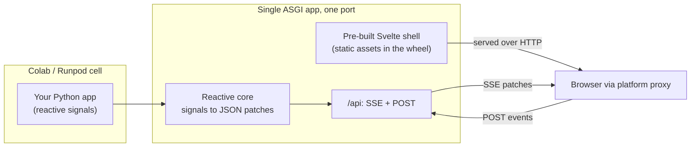

# indah

**A Python UI framework for ephemeral cloud notebooks (Colab, Runpod). Reactive,
single-port, no Node required.**

Build an interactive UI from a single Python file and launch it straight from a
Colab or Runpod cell. It keeps Streamlit's zero-config, single-port startup, adds
the async performance of a real full-stack app, and ships its frontend pre-built
so there is no Node, npm, or bun anywhere at install or runtime.

> **Status: early development.** The core works end to end from a clone: the
> reactive core, the SSE transport, async token streaming, the starter component
> set, and a custom-component seam. It is not on PyPI yet, so install from source
> for now (`uv sync --extra dev`, then `make demo`). Start with
> [`docs/PLAN.md`](docs/PLAN.md) for the plan and [`docs/SLICES.md`](docs/SLICES.md)
> for what is built.

## Why another one

| Pain | indah's answer |
|------|----------------|
| Streamlit reruns the whole script on every interaction | Reactive signals: only the affected components update ([ADR-0003](docs/adr/0003-reactive-signals-model.md)) |
| Gradio's layout and state model get awkward past a demo | Plain Python components bound to state, custom layouts |
| Reflex needs a Node build step that breaks in transient containers | Frontend ships pre-built in the wheel; zero runtime Node ([ADR-0004](docs/adr/0004-svelte-prebuilt-shell.md)) |
| Colab's proxy does not support WebSockets | SSE + HTTP POST transport that passes the proxy ([ADR-0002](docs/adr/0002-sse-plus-post-transport.md)) |

## How it will work



One port, standard HTTP plus Server-Sent Events, so it works through the network
proxies of Colab and Runpod without a tunnel or a local JavaScript toolchain.

## Try it

Launch the built-in demo: two sliders and a label computed from both.

```python
import indah

indah.launch()  # prints the URL; in Colab/Runpod it embeds the app inline
```

Drag a slider and the label updates live over SSE, with no WebSocket and no Node.
Only the components that actually depend on the changed value are patched, with no
full-script rerun.

Under the hood it uses the reactive core (this is roughly what the built-in demo
does):

```python
from indah import Signal, computed, Column, Slider, Text, Session

a, b = Signal(2), Signal(3)
total = computed(lambda: f"a + b = {a.value + b.value}")

page = Column(
    children=[
        Slider(a, min=0, max=10, label="a"),
        Slider(b, min=0, max=10, label="b"),
        Text(total),
    ]
)
# indah.launch(indah.create_app(session=Session(page)))
```

The frontend is a pre-built Svelte shell bundled in the wheel; no Node runs at
install or runtime. See [`docs/SLICES.md`](docs/SLICES.md) for what's next.

### Components

The starter set covers a typical AI demo (input, run, streamed output):

| Component | Use |
|-----------|-----|
| `Text` | a label bound to a signal, computed, or string |
| `Button` | an `on_click` handler (sync or `async def`) |
| `Slider` / `TextInput` / `Select` | inputs two-way bound to a signal |
| `Image` / `Plot` / `DataFrame` | display a URL/bytes, a Matplotlib figure, or a table |
| `StreamText` | a container that grows token by token over SSE |
| `Column` | a vertical layout container |

Need something the set does not cover? Register a custom component against the
public JSON protocol, no framework fork and no Node build:

```python
import indah

indah.register_component(
    "colorpicker",
    render={
        "tag": "input",
        "attrs": {"type": "color"},
        "bind": {"value": "value"},  # element value <- signal
        "on": {"input": {"event": "input", "prop": "value"}},  # UI change -> signal
    },
)

colour = indah.Signal("#ff8800")
picker = indah.custom("colorpicker", value=colour)  # two-way, like a built-in
```

The pre-built shell renders it from that declarative spec at runtime. The protocol
is a documented, versioned public contract: see [`docs/protocol.md`](docs/protocol.md).

Or just run the built-in demo from a clone:

```bash
make demo            # prints a URL; binds the first free port from 8000
make demo-notebook   # try indah inline in a local JupyterLab notebook
make demo-docker     # run it in Docker on an auto-picked free port
```

Prefer Docker with a stable `http://indah.localhost/` hostname (via a machine-wide
Traefik proxy)? `make demo-traefik` — see [`docs/DEV-DOCKER.md`](docs/DEV-DOCKER.md).

## Planning and design

| Doc | What |
|-----|------|
| [`docs/PLAN.md`](docs/PLAN.md) | Problem, solution, scope, requirements, architecture |
| [`docs/SLICES.md`](docs/SLICES.md) | Vertical build increments with test plans |
| [`docs/QUESTIONS.md`](docs/QUESTIONS.md) | Decision register |
| [`docs/protocol.md`](docs/protocol.md) | The JSON UI protocol (public contract) |
| [`docs/adr/`](docs/adr/) | Architecture Decision Records |

## Development

```bash
uv sync --extra dev
make check        # lint + fast tests (the pre-push gate)
make help         # list all targets
```

See [`AGENTS.md`](AGENTS.md) for repo conventions and [`docs/RELEASING.md`](docs/RELEASING.md)
for the release process.

## License

[Apache License 2.0](LICENSE).
