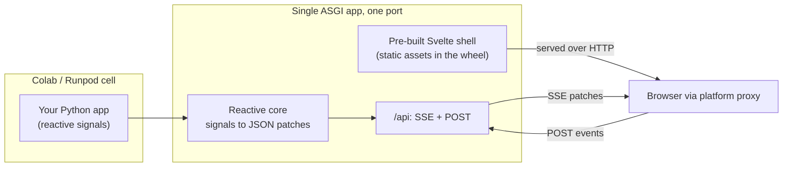

# indah

**A Python UI framework for ephemeral cloud notebooks (Colab, Runpod). Reactive,
single-port, no Node required.**

Build an interactive UI from a single Python file and launch it straight from a
Colab or Runpod cell. indah gives you zero-config, single-port startup with the async
performance of a real full-stack app, and ships its frontend pre-built so there is no
Node, npm, or bun anywhere at install or runtime.

```python
import indah
from indah import Signal, computed, Column, Slider, Text, Session

a, b = Signal(2), Signal(3)
total = computed(lambda: f"a + b = {a.value + b.value}")

page = Column(
    children=[
        Slider(a, min=0, max=10, label="a"),
        Slider(b, min=0, max=10, label="b"),
        Text(total),
    ]
)

indah.launch(indah.create_app(session=Session(page)))
```

That is a complete app. Drag a slider and only the label recomputes - no
full-script rerun. `launch()` prints a URL and, in a notebook, embeds the app
inline in the cell.

!!! note "Status: Milestone 1 components shipped"
    On top of the MVP (reactive core, SSE transport, streaming, custom-component
    seam), it adds the full input set and layout containers, data-driven lists,
    per-session state, file upload/download, and charting (server-PNG `Plot` plus
    client-side `Chart`, `Heatmap`, an interactive `Table`, `Stat` cards, and
    `ImageOverlay`). `pip install indah`, or see [Quickstart](quickstart.md).

## See it in one click

Every demo is running live in your browser - no install, no clone - and also opens in
Colab, embedded right in the cell:

[Open the live demo gallery :material-arrow-right:](https://indah-demos.fly.dev){ .md-button .md-button--primary }
[Browse the demos here :material-arrow-right:](gallery.md){ .md-button }

A streaming chatbot, a live training dashboard, an image generator, a poster
generator, and interactive charts - all in a Colab notebook or as a standalone app.

## What you get

- **Reactive, not rerun.** Mutate a signal and only the components that read it update
  - no full-script rerun on every interaction.
- **One port, no Node.** The frontend ships pre-built in the wheel, so there is nothing
  to build at install or runtime and it starts cleanly inside a transient Colab or
  Runpod container.
- **Notebook-native and proxy-friendly.** SSE plus HTTP POST over a single port passes
  the network proxies of Colab and Runpod - no WebSocket and no tunnel.
- **Plain Python components bound to state**, with custom layouts and a
  custom-component seam for when you outgrow the built-in set.

Reach for indah when you want a reactive app that runs inline in Colab or Runpod today
and deploys as a standalone app tomorrow, with no Node anywhere.

## How it works



One port, standard HTTP plus Server-Sent Events, so it works through the network
proxies of Colab and Runpod without a tunnel or a local JavaScript toolchain. You
describe the UI in Python; the reactive core turns signal changes into minimal JSON
patches; the pre-built shell renders the tree and applies patches by node id.

## Where to go next

- [Quickstart](quickstart.md) - install, write your first app, and launch it.
- [Components](components.md) - the starter set for a typical AI demo.
- [Custom components](custom-components.md) - register your own without forking or
  a Node build.
- [Protocol](protocol.md) - the versioned JSON contract between Python and the shell.

The design docs (plan, slices, ADRs) live in the
[repository](https://github.com/leejianrong/indah/tree/main/docs).
