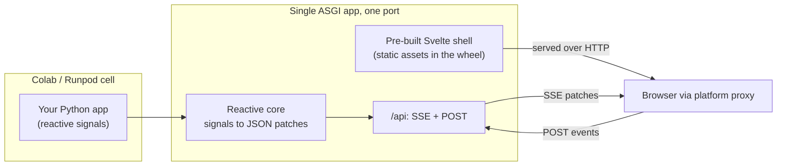

# indah

**A Python UI framework for ephemeral cloud notebooks (Colab, Runpod). Reactive,
single-port, no Node required.**

Build an interactive UI from a single Python file and launch it straight from a
Colab or Runpod cell. indah keeps Streamlit's zero-config, single-port startup,
adds the async performance of a real full-stack app, and ships its frontend
pre-built so there is no Node, npm, or bun anywhere at install or runtime.

```python
import indah
from indah import Signal, computed, Column, Slider, Text, Session

a, b = Signal(2), Signal(3)
total = computed(lambda: f"a + b = {a.value + b.value}")

page = Column(
    children=[
        Slider(a, min=0, max=10, label="a"),
        Slider(b, min=0, max=10, label="b"),
        Text(total),
    ]
)

indah.launch(indah.create_app(session=Session(page)))
```

That is a complete app. Drag a slider and only the label recomputes - no
full-script rerun. `launch()` prints a URL and, in a notebook, embeds the app
inline in the cell.

!!! note "Status: early development, MVP feature-complete"
    The core works end to end: the reactive core, the SSE transport, async token
    streaming, the starter component set, and a custom-component seam. The `indah`
    name is reserved on PyPI; the first release is being cut as `0.1.0rc1`. See
    [Quickstart](quickstart.md) to run it today from a clone.

## See it in one click

Every demo opens in Colab and embeds right in the cell - no install, no clone:

[Open the demo gallery :material-arrow-right:](gallery.md){ .md-button .md-button--primary }

A streaming chatbot, a live training dashboard, an image generator, a poster
generator, and interactive charts - all in a Colab notebook or as a standalone app.

## Why another one

| Pain | indah's answer |
|------|----------------|
| Streamlit reruns the whole script on every interaction | Reactive signals: only the affected components update |
| Gradio's layout and state model get awkward past a demo | Plain Python components bound to state, custom layouts |
| Reflex needs a Node build step that breaks in transient containers | Frontend ships pre-built in the wheel; zero runtime Node |
| Colab's proxy does not support WebSockets | SSE + HTTP POST transport that passes the proxy |

indah is **SSE-first** - the same architecture Google's Mesop bet on before it was
retired - carried forward and made notebook-native. Reach for indah when you want a
reactive app (not a full-script rerun) that runs inline in Colab or Runpod today and
deploys as a standalone app tomorrow, with no Node anywhere.

## How it works



One port, standard HTTP plus Server-Sent Events, so it works through the network
proxies of Colab and Runpod without a tunnel or a local JavaScript toolchain. You
describe the UI in Python; the reactive core turns signal changes into minimal JSON
patches; the pre-built shell renders the tree and applies patches by node id.

## Where to go next

- [Quickstart](quickstart.md) - install, write your first app, and launch it.
- [Components](components.md) - the starter set for a typical AI demo.
- [Custom components](custom-components.md) - register your own without forking or
  a Node build.
- [Protocol](protocol.md) - the versioned JSON contract between Python and the shell.

The design docs (plan, slices, ADRs) live in the
[repository](https://github.com/leejianrong/indah/tree/main/docs).
